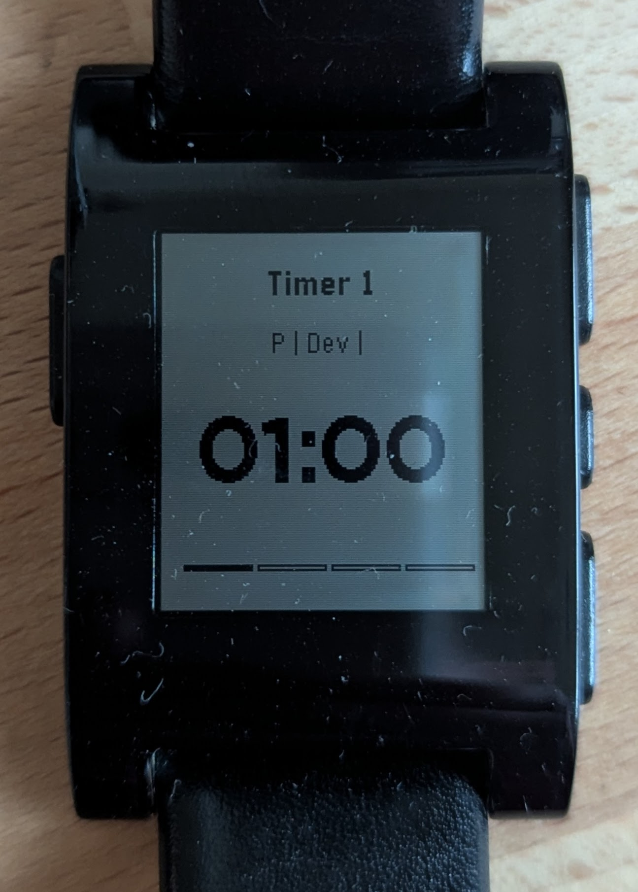
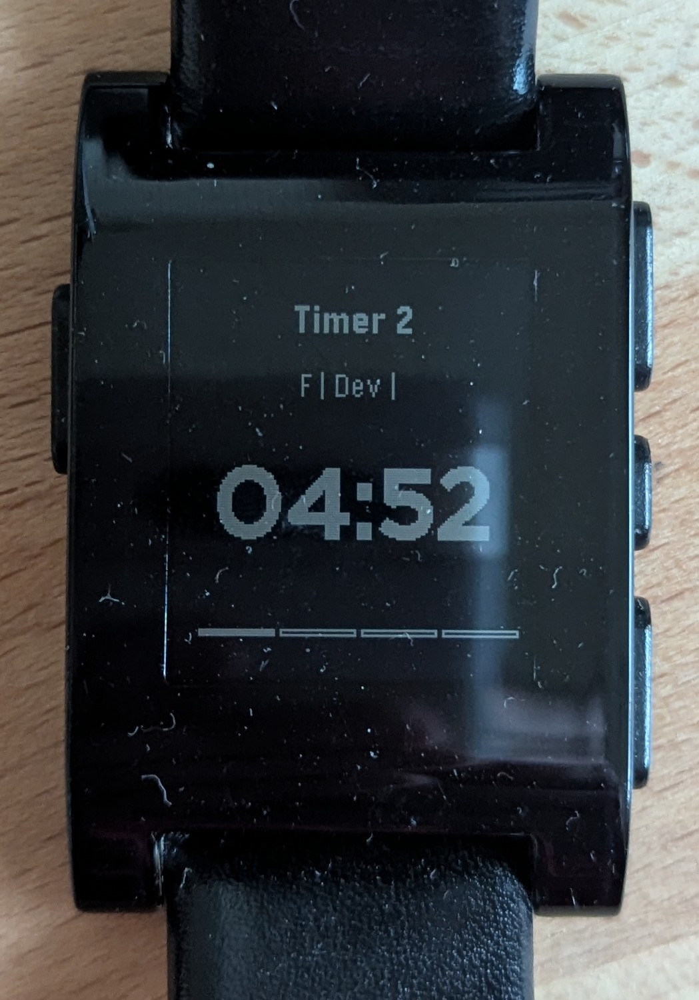
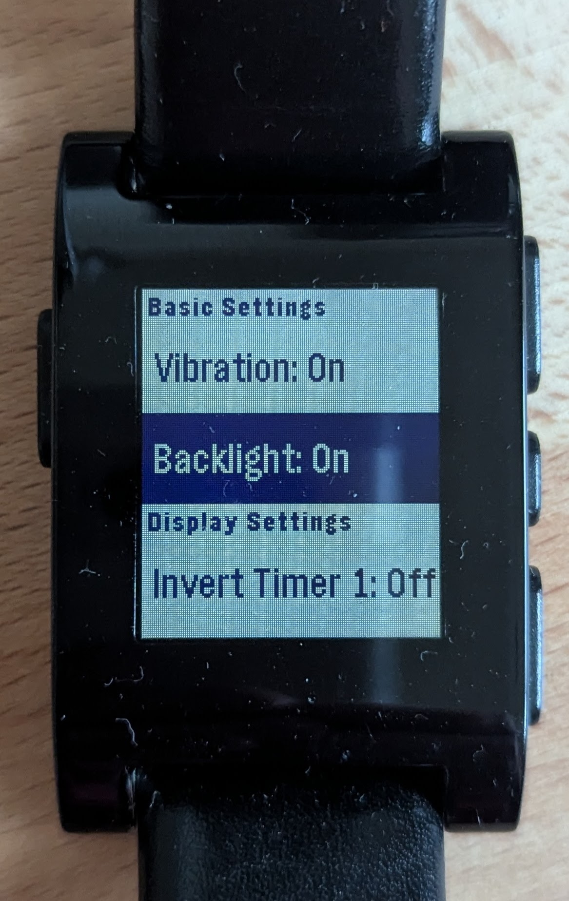

# pebble-darkroom

## Overview

Pebble Darkroom is a specialized timer application designed for film and print development in darkroom photography. The app provides separate timers for each stage of the development process, with dedicated support for both RC (Resin Coated) and Fiber paper types. Each timer features distinct visual themes and stage progressions optimized for professional darkroom workflows.

## Features

- **Dual Timer System**: Run two independent timers simultaneously for managing multiple development processes
- **Paper-Specific Modes**: 
  - Timer 1: RC (Resin Coated) paper with 4-stage processing and light theme
  - Timer 2: Fiber paper with 6-stage processing including hypo clear and extended wash cycles, with dark theme
- **Film Mode**: Traditional film development process available on both timers
- **Extended Stage Support**: 
  - RC Paper: Develop → Stop → Fix → Wash (4 stages)
  - Fiber Paper: Develop → Stop → Fix → Wash → Hypo Clear → Wash2 (6 stages)
- **Enhanced Visual Design**: Larger fonts and improved readability for darkroom conditions
- **Smart Mode Indicators**: Clear display format showing paper type, mode, and current stage
- **Customizable Timing**: Independent timing configuration for RC and Fiber paper workflows
- **Display Themes**: Automatic light/dark themes with optional color inversion
- **Haptic Feedback**: Distinctive vibration patterns for each timer
- **Pause/Resume**: Full control over timer progression
- **Manual Stage Advancement**: Timers don't automatically start the next stage, giving you full control
- **Screen Refresh**: Force screen refresh to address screen tearing

## Screenshots

> **Note**: Screenshots below show the previous interface. The enhanced version features larger fonts, improved mode indicators showing paper types (RC/FB), and updated visual themes with Timer 1 defaulting to light mode and Timer 2 to dark mode.





## Using the App

### Basic Controls

- **UP Button**:
  - **Press**: Reset the active timer to the first stage
  - **Long Press**: Scroll forward through stages in current timer
  - **Double Press**: switch paper type when in Print mode

- **SELECT Button (Middle)**:
  - **Press**: Open settings menu
  - **First menu item**: Force screen refresh (helps with screen tearing)

- **DOWN Button**:
  - **Press**: Start/Pause/Resume the active timer
  - **Long Press**: Scroll backward through stages in current timer
  - **Double Press**: switch mode from Film to Print (and vice versa)

### Timer Operation

1. **Starting a Development Process**:
  - Choose Film or Print mode using DOWN double-click
  - Press DOWN button to start the first stage (Develop)
  - Both timers can run simultaneously

2. **Paper Type Selection**:
  - **Timer 1 (Print Mode)**: Automatically configured for RC paper processing
  - **Timer 2 (Print Mode)**: Automatically configured for Fiber paper processing
  - **Film Mode**: Available on both timers with traditional 4-stage process

3. **Between Stages**:
  - When a stage completes, the app will:
    - Vibrate with a pattern specific to the active timer
    - Timer 1: Single pulse
    - Timer 2: Double pulse
  - The app will automatically advance to the next stage but will wait for you to start it
  - After 2 seconds, a reminder vibration occurs with the same pattern
  - Press DOWN button to start the next stage when ready
  - Press DOWN long press to scroll backward through stages

4. **Pausing/Resuming**:
  - Press DOWN button once to pause a running timer
  - Press DOWN button again to resume the timer

5. **Resetting**:
  - Press UP button once to reset the timer to the first stage

### Timer Indicators

The app uses an enhanced display format: **[Mode] | [Paper Type] | [Stage] | [Status]**

- **Mode Indicators**: 
  - `P` = Print mode
  - `F` = Film mode
- **Paper Type Indicators** (Print mode only):
  - `RC` = RC (Resin Coated) paper (Timer 1)
  - `FB` = Fiber paper (Timer 2)
- **Stage Indicators**:
  - RC Paper: `Dev`, `Stop`, `Fix`, `Wash`
  - Fiber Paper: `Dev`, `Stop`, `Fix`, `Wash`, `HC` (Hypo Clear), `Wash2`
  - Film: `Dev`, `Stop`, `Fix`, `Wash`
- **Status**: `RUNNING`, `PAUSED`, or blank when stopped
- **Visual Themes**:
  - Timer 1: Light background with black text (default)
  - Timer 2: Dark background with white text (default)
- Progress bar shows current stage position relative to total stages
- Timer display shows remaining time in minutes:seconds format with larger, more readable fonts

## Settings Menu

Access the settings menu by pressing the SELECT button.

### Basic Settings

- **Vibration**: Toggle vibration alerts on/off
- **Backlight**: Toggle screen backlight on/off

### Display Settings

- **Invert Timer 1**: Toggle color inversion for Timer 1
- **Invert Timer 2**: Toggle color inversion for Timer 2
- **Invert Menu**: Toggle color inversion for settings menu

### Film Times

Customize seconds for each film development stage:
- Develop (default: 5:00)
- Stop (default: 1:00)
- Fix (default: 5:00)
- Wash (default: 5:00)

### RC Print Times

Customize seconds for each RC paper development stage:
- Develop (default: 1:00)
- Stop (default: 0:30)
- Fix (default: 5:00)
- Wash (default: 5:00)

### Fiber Print Times

Customize seconds for each Fiber paper development stage:
- Develop (default: 2:00)
- Stop (default: 0:30)
- Fix (default: 2:00)
- Wash (default: 5:00)
- Hypo Clear (default: 2:00)
- Wash2 (default: 15:00)

## Use Cases

### RC Paper Workflow (Timer 1)

1. Timer 1 is pre-configured for RC paper (light theme)
2. Double-click DOWN to set Print mode if needed
3. The display will show `P | RC | Dev |` indicating RC paper mode
4. Follow the 4-stage process: Develop → Stop → Fix → Wash
5. Timer 1 uses optimized timing for RC paper's faster processing

### Fiber Paper Workflow (Timer 2)

1. Timer 2 is pre-configured for Fiber paper (dark theme)
2. Double-click DOWN to set Print mode if needed
3. The display will show `P | FB | Dev |` indicating Fiber paper mode
4. Follow the 6-stage process: Develop → Stop → Fix → Wash → HC → Wash2
5. Timer 2 includes hypo clear stage and extended wash cycles for proper fiber processing

### Processing Both Paper Types Simultaneously

1. Both timers run simultaneously by default
2. Timer 1 is pre-configured for RC paper, Timer 2 for Fiber paper
3. Start Timer 1 for RC paper development
4. Start Timer 2 for Fiber paper development
5. Both timers maintain their own stage progression independently
6. Visual themes help distinguish between the two processes at a glance
7. Use DOWN long press to scroll backward through stages if you need to adjust

### Understanding RC vs Fiber Paper Processing

**RC (Resin Coated) Paper - Timer 1:**
- Faster processing with 4 stages
- Shorter wash times due to resin coating
- Light theme for easy identification
- Typical workflow: 1 min develop, 30 sec stop, 5 min fix, 5 min wash

**Fiber Paper - Timer 2:**
- Extended processing with 6 stages
- Requires hypo clear treatment to remove residual fixer
- Longer wash cycles for archival processing
- Dark theme for easy identification
- Typical workflow: 2 min develop, 30 sec stop, 2 min fix, 5 min wash, 2 min hypo clear, 15 min wash2

### Film Development

1. Both timers support Film mode
2. Set to Film mode using DOWN double-click
3. Both timers support traditional 4-stage film development
4. Use both timers for different film types or simultaneous processing

### Working in Dark Conditions

1. Enable Backlight setting if needed
2. Timer 1 (light theme) and Timer 2 (dark theme) provide visual distinction
3. Consider inverting display colors for better visibility
4. Use haptic feedback to track timer completion
5. Larger fonts improve readability in low-light conditions

## Building and Installing the App

### Prerequisites
- Docker
- Make
- Pebble smartphone app installed on your device
- [Rebble web services setup](https://help.rebble.io/setup) (optional)

### Building the App
1. Clone the repository:
```bash
git clone https://github.com/toozej/pebble-darkroom.git
cd pebble-darkroom
```

2. Build the app using Docker:
```bash
make build
```

### Running the Emulator

1. Run the following command to build and start the emulator:
```bash
make emulate
```
2. Open your web browser and navigate to `http://127.0.0.1:8080` to view the emulator.

### Installing on Your Pebble

1. Build the app as described above
2. Locate the `.pbw` file in the `app/pebble-darkroom/build` directory
3. Send this file to your phone
4. Open the file with the Pebble app to install

## Technical Details

### Persistent Storage

The app saves your settings between sessions, including:
- Vibration and backlight preferences
- Color inversion settings
- Custom timer durations for each stage

## Troubleshooting

### Screen Tearing

If you experience screen tearing (horizontal lines across the display):
1. Select the first item in the settings menu to force a screen refresh
2. If the issue persists, try [this fix](https://gamedummy.com/pebblefix/)

### Timer Not Advancing

If the timer completes but doesn't seem to advance to the next stage:
1. Check that vibration is enabled in settings
2. Remember that you need to manually start each stage with the DOWN button
3. Verify that the watch hasn't entered power-saving mode
4. Note that RC paper has 4 stages while Fiber paper has 6 stages - ensure you're expecting the correct number of stages for your paper type

### Settings Not Saving

If your custom settings aren't persisting between app launches:
1. Make sure to fully exit the settings menu before closing the app
2. Check that your Pebble has sufficient storage space available
3. Try rebuilding and reinstalling the app
4. Note that RC and Fiber paper settings are stored separately - changes to one won't affect the other

### Paper Type Confusion

If you're unsure which paper type is active:
1. Check the mode indicator: `RC` for Timer 1, `FB` for Timer 2 in print mode
2. Timer 1 defaults to light theme, Timer 2 to dark theme
3. RC paper shows 4 stages, Fiber paper shows 6 stages in the progress indicator
4. Fiber paper includes `HC` (Hypo Clear) and `Wash2` stages that RC paper doesn't have
